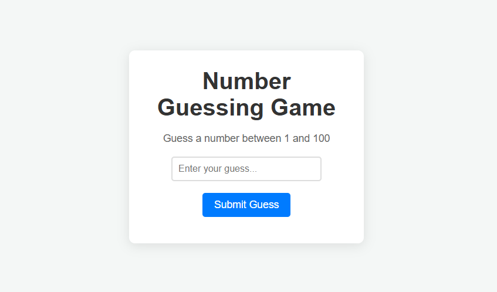

# 02 Guess the Number Game

This is a simple "Guess the Number" game built using HTML, CSS, and JavaScript. The game generates a random number between 0 and 99, and the player needs to guess that number. The game provides feedback based on whether the guess is too high or too low, and it shows the correct number once the player guesses it correctly.

## Features
- **Random Number Generation**: A random number between 0 and 99 is generated at the start of the game.
- **User Feedback**: Provides feedback such as "Nope! Guess higher number" or "Nope! Guess lower number" when the guess is incorrect.
- **Play Again Button**: Allows users to start a new game after guessing the correct number.
- **Responsive Design**: The layout adapts to different screen sizes.

## Getting Started

### Clone the Repository:
To get started, clone the repository to your local machine:

```bash
git clone https://github.com/mayurbadgujar03/JavaScript-20-Day-Challenge-Building-20-Basic-Projects.git
```
### **Open the Project:**
Navigate to the project directory and open the ```index.html``` file in your web browser.

### **Usage:**

1. Enter your guess in the input field.
2. Click the "Submit Guess" button to check if your guess is correct.
3. The game will display feedback:
   - If your guess is too low: "Nope! Guess higher number."
   - If your guess is too high: "Nope! Guess lower number."
   - If your guess is correct, the number will be displayed, and you can click the      "Play Again" button to start a new round.

## **Technologies Used**
- **HTML:** For the structure and layout of the game.
- **CSS:** For styling and responsiveness.
- **JavaScript:** For the game logic and interactivity.
## **Code Explanation**

### **Main Logic:**
- **Random Number Generation:** When the page loads, a random number ```x``` between 0 and 99 is generated using ```Math.random()```.
- **User Input:** The user enters a guess in the input field, and clicking the "Submit Guess" button triggers the ```Game``` function.
- **Game Function:** This function compares the user's guess with the generated number:
  - If the guess is correct, the number is displayed, and the "Play Again" button becomes visible.
  - If the guess is too low or too high, a corresponding message is shown.
- **Play Again:** Clicking the "Play Again" button resets the game, clears the inputs, and generates a new random number.


## **Example of Operations:**
- **Guessing a number:**
    - Enter ```45``` and click "Submit Guess". If the generated number is ```72```, the game will display: "Nope! Guess higher number".
    - Enter ```72``` and click "Submit Guess". The game will display: ```72``` and show the "Play Again" button.
- **Incorrect Guess:**
    - If the user guesses a number that is too high, for example, ```80```, the game will display: "Nope! Guess lower number".

## **Preview**
Here is a screenshot of how the game looks: <br>

