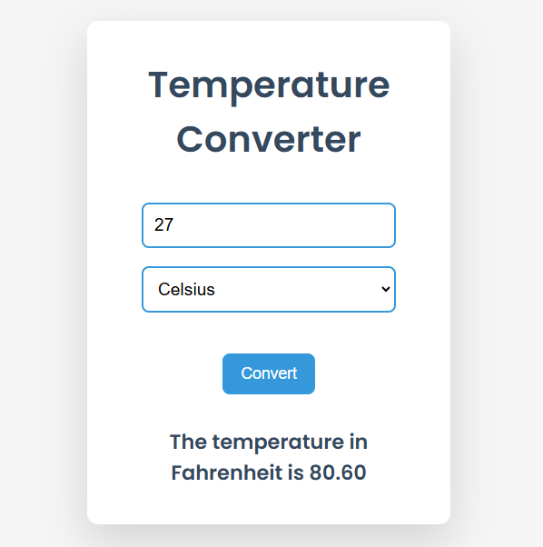

# 03 Temperature Converter 🌡️

A simple web application built with HTML, CSS, and JavaScript that allows users to convert temperatures between Celsius and Fahrenheit. 🔄

## Features ✨

- **Convert Celsius to Fahrenheit**: Enter a temperature in Celsius, and the app will convert it to Fahrenheit. ➡️🌡️
- **Convert Fahrenheit to Celsius**: Enter a temperature in Fahrenheit, and the app will convert it to Celsius. 🌡️➡️❄️
- **Simple and interactive UI**: The app includes an input field for the temperature and a dropdown to select the conversion type (Celsius or Fahrenheit). 🖱️
- **Real-time conversion**: Results are displayed as soon as the user clicks the convert button. ⚡

## How It Works ⚙️

1. The user enters a temperature in the input field. ✍️
2. The user selects the unit they want to convert to from the dropdown menu (Celsius or Fahrenheit). 📥📤
3. Upon clicking the **Convert** button, the app performs the conversion and displays the result below the input field. ✅

## Technologies Used 🛠️

- **HTML**: For the basic structure of the web page. 🏗️
- **CSS**: For styling the page (optional, depending on your styling). 🎨
- **JavaScript**: For handling the temperature conversion logic and interactive behavior. 💻

## Installation 🚀

1. Clone or download the project files.
```bash
git clone https://github.com/mayurbadgujar03/JavaScript-20-Day-Challenge-Building-20-Basic-Projects.git
```
### **Open the Project:**
Open the ```index.html``` file in your browser to start using the temperature converter. 🌍

### **Usage:**

1. Enter a value in the input field for the temperature. 🔢
2. Select the unit to convert to (Celsius or Fahrenheit) from the dropdown. 📐
3. Click the Convert button to view the result. 👇

## **Code Explanation** 📚

**HTML:** The HTML file contains an input field for the temperature, a dropdown to select the unit, and a button to trigger the conversion. 🖋️
**JavaScript:** The JavaScript file listens for a click event on the **Convert** button, gets the value from the input field, and then performs the necessary calculation to convert between Celsius and Fahrenheit. The result is displayed dynamically. 🔄

## **Example of Operations:** 🔄
### Converting Celsius to Fahrenheit:
- Input: 25°C 🌡️
- Output: 77°F 🌡️
### Converting Fahrenheit to Celsius:
- Input: 77°F 🌡️
- Output: 25°C ❄️

## **Preview** 📸
Here is a screenshot of how the temperature converter looks: <br>

