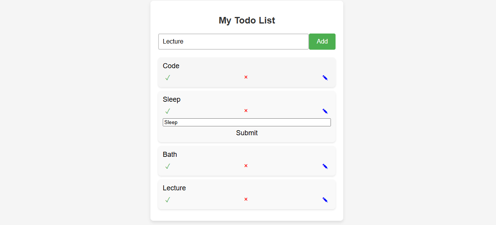

# 📋 **To-Do List** 🗂️

Welcome to the **To-Do List** app! 🎯 A simple yet powerful task management tool built with HTML, CSS, and JavaScript to help you stay organized and productive. Whether it's work, school, or personal tasks, this app lets you manage and track your to-dos with ease! ✅

---

## ✨ **Features** ✨

- **Add Tasks**: Quickly add new tasks to your to-do list and stay organized. 📝
- **Mark Tasks as Completed**: Check off tasks once they’re done and watch them get marked with a stylish strike-through. ✅
- **Edit Tasks**: Made a mistake? No worries! Click the pencil ✏️ and modify your task easily.
- **Delete Tasks**: Finished with a task or want to get rid of it? Hit the 'X' to remove it forever! ❌
- **Interactive UI**: A clean and simple design that makes task management fun! 🎨
- **Real-Time Updates**: The tasks get updated instantly as you interact with them. ⚡

---

## ⚙️ **How It Works** ⚙️

1. **Add a New Task**: Type your task in the input field and either click the "Add" button or press **Enter** to add it to your list. 🖊️
2. **Mark as Completed**: Click the checkmark ✅ button to mark a task as completed. It’ll visually change to show you're done! 💯
3. **Edit a Task**: Click the pencil ✏️ to edit a task. Change the text and click submit to save it. 🔄
4. **Delete a Task**: Click the 'X' to remove a task from your to-do list if it's no longer needed. 🗑️

---

## 🛠️ **Technologies Used** 🛠️

- **HTML**: For the structure of the app. 🏗️
- **CSS**: For styling the page and making it look clean and minimalistic. 🎨
- **JavaScript**: For managing task interactions, such as adding, editing, and deleting tasks. 💻

---

## 🚀 **Installation** 🚀

Clone or download the project files:
```bash
git clone https://github.com/mayurbadgujar03/JavaScript-20-Day-Challenge-Building-20-Basic-Projects.git
```
## Open the Project:

Open the ```index.html``` file in your browser to start using the To-Do List app. 🌍

## 📚 Usage 📚
- **Enter a Task:** Type your task in the input field. ✍️
- **Add the Task:** Click the "Add" button or press Enter to add it to your list. 📥
- **Mark as Completed:** Click the checkmark ✅ to mark tasks as done.
- **Edit Tasks:** Modify any task by clicking the pencil ✏️ button.
- **Delete Tasks:** Click the 'X' to remove a task from your list. ❌

## 📸 Preview 📸
Here’s a preview of the app in action:



## 🔄 Code Explanation 🔄
- **HTML:** The HTML file contains the structure with an input field, a button to add tasks, and buttons to edit, delete, and mark tasks as completed. 🖋️
- **JavaScript:** The JavaScript file handles the functionality behind the tasks. It listens for events like button clicks and Enter presses to add, edit, complete, or delete tasks. 🖥️

## Example Operations:
- **Adding a Task:**
**Input:** "Complete JavaScript project" 📝
**Action:** Press the "Add" button or hit Enter. ✅
The task appears in your to-do list! 🎉

- **Editing a Task:**
**Input:** "Complete JavaScript project" 📝
**Action:** Click the pencil ✏️, change the text to "Complete JavaScript project v2" 🔄.
The updated task appears! 🔄

- **Marking a Task as Completed:**
**Input:** "Complete JavaScript project" ✅
**Action:** Click the checkmark ✅ button.
The task gets marked as completed! 🎯
## 💡 Why This Project? 💡
This To-Do List project is part of my journey to practice and improve my JavaScript skills! 🌟 Every day, I am building something new, and this project is helping me learn how to manipulate the DOM, manage events, and create interactive user interfaces! 💪

Stay organized, stay productive, and remember to check off those tasks! ✅
