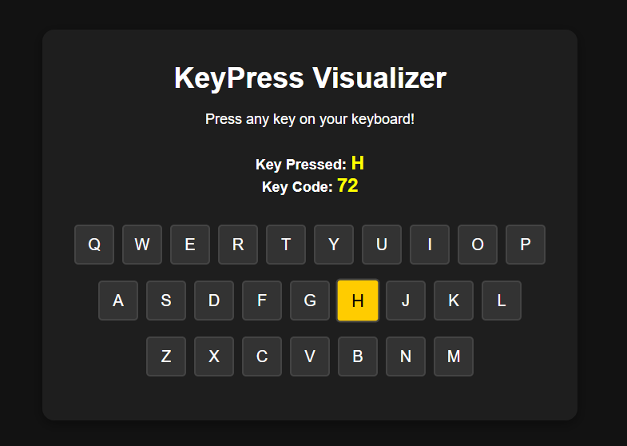

# 🌟 KeyPress Visualizer with Keyboard Layout 🌟

### ✨ Welcome to the KeyPress Visualizer! ✨

Have you ever wondered what happens *behind the scenes* when you press a key on your keyboard? 🤔 Well, wonder no more! The **KeyPress Visualizer with Keyboard Layout** is here to bring those mysterious keypresses to life in an interactive and visually stunning way! 🔑🎉

Whether you're a keyboard enthusiast, a developer, or just someone who loves tech magic, this project will reveal the secret powers of each key you press, illuminating your keyboard layout in real-time. 🌈

## 🖥️ How It Works

Once you launch the KeyPress Visualizer, you will witness your keyboard come to life right before your eyes! 🎬💻 Each time you press a key, the app displays its name and keycode, highlighting the exact key on the screen as you type. It's like watching your own virtual keyboard *light up* with every press. 🌟

The magic happens in the background, powered by JavaScript, using event listeners to capture the keypress and update the layout instantly. 🔄 It’s like a dance between your fingers and the code! 💃🕺

## 🔑 Key Features

- **Interactive Keyboard Layout**: See your keyboard keys light up as you press them! ✨
- **Key Information Display**: Shows the name and keycode of the key you pressed. 🧑‍💻
- **Dynamic Updates**: As you type, the app dynamically updates in real-time! ⚡
- **Cross-platform**: Works on all devices with a keyboard, including desktops, laptops, and more! 🌍

## 🚀 Technologies Used

- **HTML**: For building the layout of the virtual keyboard. 🏗️
- **CSS**: For styling and creating the glowing effects of active keys. 🎨✨
- **JavaScript**: The magic that makes it all happen! It listens for keypress events and updates the layout. 🧙‍♂️

## 📱 Demo

Imagine you’re typing away on your keyboard 🖋️, and suddenly, *boom!*—your keys light up, and you can see their names and codes. You might even start feeling like a wizard casting spells as each key reacts. 🧙‍♀️✨

Here’s a preview of what this looks like: 


## 📥 Installation

Getting the KeyPress Visualizer up and running on your local machine is as easy as 1-2-3!

1. **Clone this repository** to your local machine:
    ```bash
    git clone https://github.com/mayurbadgujar03/JavaScript-20-Day-Challenge-Building-20-Basic-Projects.git
    ```
2. **Open the folder** in your code editor. 📝
3. **Launch the project** by opening `index.html` in your browser. 🌐

## 🔧 How to Use

1. Open the project in your browser. 🚀
2. Press any key on your physical keyboard, and watch it come to life on the screen! 🧑‍💻
3. See the key’s name and keycode displayed right beside it. 🖋️
4. Let the fun begin—keep pressing different keys and watch them light up! 🌟

## 🌟 Why You Should Try It

This project is not only fun to interact with, but it also serves as a fantastic learning tool for understanding key events in JavaScript! 👨‍💻👩‍💻 If you're learning how to handle keypresses or just want to play with keyboard events, this is the perfect hands-on experience. 🎮

---

Now go ahead and give it a try! Type away and see how your keyboard transforms into a glowing masterpiece, showcasing every keystroke. ✨🔥

Happy coding! 👨‍💻👩‍💻
