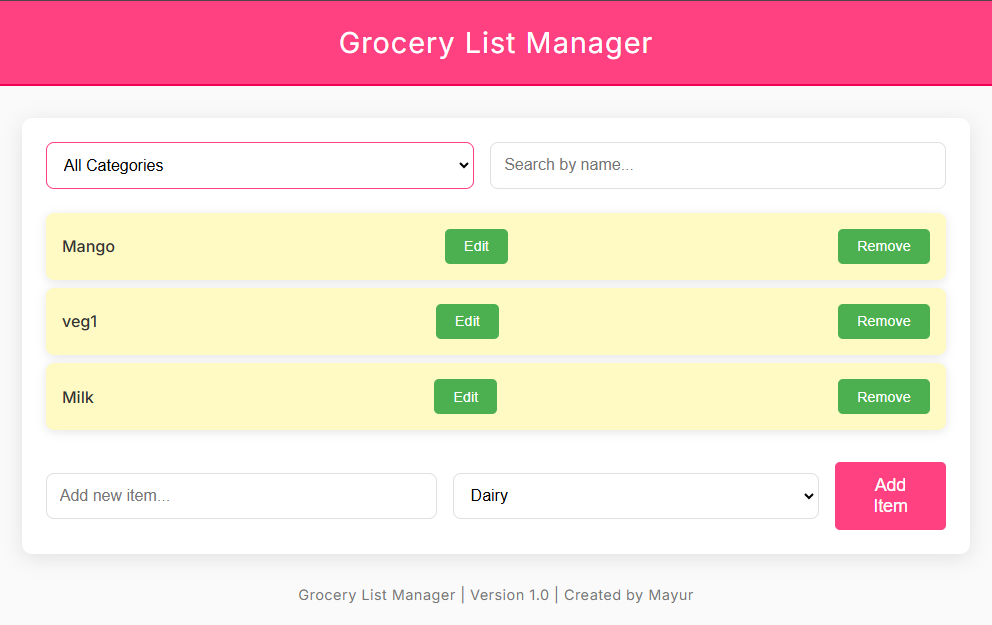

# 🛒 **Grocery List Manager** 🌟

## ✨ Introduction

Welcome to the **Grocery List Manager** - the ultimate solution to manage your grocery items with ease and style! 📝🌱 Whether you're a home chef 🥘, a busy professional 🍔, or simply someone who loves to organize 🗂️, this app is built just for you. Gone are the days of scribbled lists on sticky notes and random grocery apps that don't quite hit the mark. This modern, sleek, and user-friendly tool will keep all your grocery essentials in one place, effortlessly! 🚀

With this app, you can:
- 🛒 **Add items** to your grocery list
- 🗂️ **Filter by category** (Fruits 🍏, Vegetables 🥦, Dairy 🧀, etc.)
- 🔍 **Search by name** to quickly find what you need
- ✏️ **Edit items** with a simple click
- 🗑️ **Remove items** from your list as needed

And the best part? It's simple to use, beautiful to look at, and fully responsive! 💻📱

### 📸 **Screenshot**:

Here’s a sneak peek of what your grocery list will look like!



## 📱 Features

### 🌟 Key Features:
- **Add Items**: Add grocery items with just a click! Choose a category and type the name of the item 📝.
- **Category Filtering**: Want to see only fruits or veggies? Filter by categories like Fruits, Vegetables, or Dairy! 🍓🥦🧈
- **Search by Name**: Quickly search through your list of grocery items to find what you need 🔍.
- **Edit Items**: Make updates to your grocery list on the fly ✏️.
- **Remove Items**: Deleting an item is a breeze 🗑️.

### 🎨 A Beautiful, Modern UI:
- Gorgeous design with vibrant colors and smooth animations ✨.
- Intuitive layout that makes managing your grocery list a fun and easy task 😊.
- Mobile and desktop-friendly! 📱💻

### 🛠️ Technologies Used:
- **HTML5**: For structure and content 🖋️
- **CSS3**: For a sleek, modern, and responsive design 🎨
- **JavaScript**: For adding interactivity and dynamic content 🖥️

---

## 🧩 How It Works

1. **Start by Adding Items** 🛒  
   Simply type in the name of an item, select its category (Fruits 🍏, Vegetables 🥕, Dairy 🧀), and hit the "Add Item" button! ✅

2. **Categorize** 🎯  
   Your items are organized by categories, so you can quickly view just what you need — whether you're preparing a salad 🥗 or making a smoothie 🥤.

3. **Filter and Search** 🔍  
   Filter your list by category or search by name to find your items faster! It’s as easy as 1-2-3 🥳.

4. **Edit and Remove Items** 📝  
   Made a mistake or changed your mind? Edit or remove items with a click of a button! You’re in full control 😎.

---

## 🚀 How to Install

Ready to get started? Here’s how you can set up the **Grocery List Manager** on your own computer:

1. **Clone the Repo**  
   Open your terminal and type the following command to clone the repository:

   ```bash
       git clone https://github.com/mayurbadgujar03/JavaScript-20-Day-Challenge-Building-20-Basic-Projects.git
    ```
2. **Open the Project**
Navigate to the project folder and open the index.html file in your browser 🌍:
```
cd grocery-list-manager
open index.html  
```
3. **Start Managing Your Grocery List!**
You’re all set! 🎉 Start adding, filtering, searching, and organizing your grocery items 🛍️.

---

# 🎉 **Let's Get Organized!**
Don't wait! Give the Grocery List Manager a try today and experience the future of grocery management. 🌟 We’re sure you’ll love it as much as we do. Happy shopping! 🛒💖
