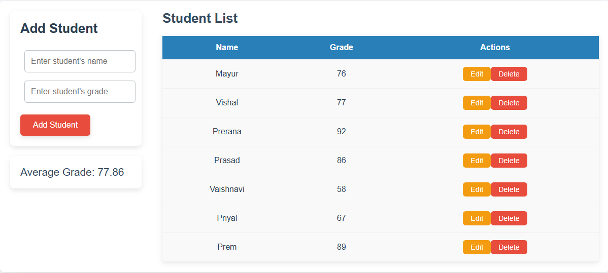

# 🎓 **Student Grades Tracker** 📊

Welcome to the **Student Grades Tracker**, your trusty companion in the pursuit of academic excellence! 🌟 This powerful web app helps you keep track of students' names and their grades, making it easier than ever to stay organized and monitor progress. Whether you're a teacher, tutor, or even a student managing your own grades, this app has you covered! 🎒

## 📖 **Story Behind the Project** 📖

The inspiration behind the **Student Grades Tracker** comes from the chaotic world of grading. 📝 With grades scattered across papers, emails, and spreadsheets, it can be hard to keep everything in order. This project was born out of the need to simplify this process, giving users an intuitive platform to add, edit, and delete student records with ease. No more shuffling through papers or spreadsheets – now, everything is in one place! ✨

## 🚀 **Features** 🚀

🔹 **Add Students**: Input students' names and grades with ease.  
🔹 **Edit Grades**: Made a mistake or need to update a grade? No worries! Just edit it in a flash.  
🔹 **Delete Students**: Remove any student records that are no longer relevant.  
🔹 **Automatic Grade Calculation**: The average grade is updated in real-time to give you a quick overview of class performance. 🏆  
🔹 **User-Friendly Interface**: Clean, minimal design so you can focus on what matters most – the students! 🖥️

## 🧑‍💻 **Technologies Used** 🧑‍💻

- **HTML5**: The backbone of the app's structure.  
- **CSS3**: Styling the project for a sleek, polished design.  
- **JavaScript**: Bringing everything to life – from adding and removing students to calculating the average grade. 🔥

## 🛠️ **How It Works** 🛠️

1. **Add a Student**: Simply enter the student’s name and grade, then click the "Add Student" button. The student will appear in the table, along with their grade.  
2. **Edit a Grade**: Want to make a change? Click the "Edit" button next to the student’s grade and input the new grade. It's that simple!  
3. **Delete a Student**: When it’s time to let go of a student record, just click "Delete" to remove them from the list.  
4. **See the Average**: The app automatically calculates the average grade, updating it each time you add or modify a student's record.

## 🔥 **Installation Instructions** 🔥

To run the **Student Grades Tracker** locally, follow these simple steps:

1. **Clone the repository**:
   ```bash
       git clone https://github.com/mayurbadgujar03/JavaScript-20-Day-Challenge-Building-20-Basic-Projects.git
   ```
2. **Navigate into the project directory**:
   ```bash
      cd student-grades-tracker
   ```
3. **Open the** ```index.html``` **file** in your favorite browser, and you’re ready to go!

## 📸 Screenshots 📸
Here’s a glimpse of what the app looks like:

A snapshot of the user interface with student records in action.

## 🎯 Why Use It? 🎯
- **For Teachers**: Stay on top of your students' performance and track improvements over time. 📈
- **For Tutors**: Easily monitor your students' progress with quick access to their grades.
- **For Students**: Keep your own grades in check and strive to improve your academic performance! 🎓
- **For Everyone**: Stay organized, save time, and focus on what matters most – learning and teaching! 🙌
