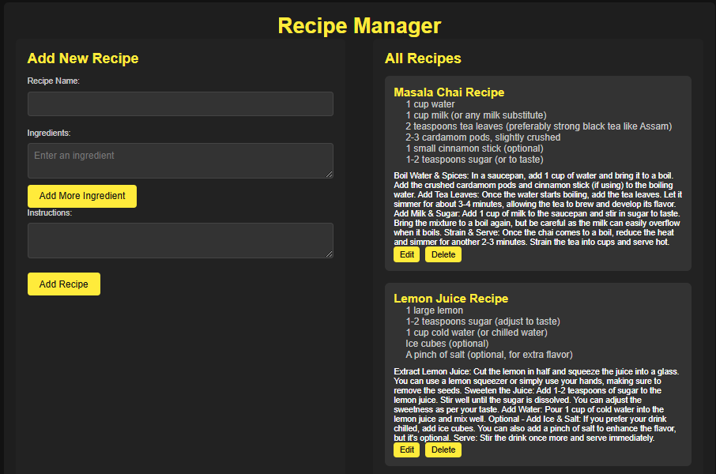

# 🍴 Recipe Manager App 🍽️

## 📜 The Tale of a Kitchen Hero 👩‍🍳

Once upon a time in a cozy kitchen, there was a loving mother—my mummy—who spent countless hours cooking delicious meals for our family. From hearty stews to scrumptious desserts, her culinary skills knew no bounds. But there was a small problem... every time she wanted to prepare a dish, she would rummage through piles of handwritten recipes, sticky notes, and old cookbooks. Recipes were lost, ingredients were forgotten, and the magic of her kitchen felt chaotic. 😩📚

One day, while cleaning the kitchen after a hearty family meal, she sighed, "I wish there was a way to organize all these recipes in one place!" 

That's when the idea struck me—a simple, user-friendly app that would allow her to store, organize, and access her recipes with ease. And so, the **Recipe Manager App** was born! 🥳🍲

---

## 🎯 Features & Functionality 🚀

This app is designed with love, specifically for **mummy** (and anyone else who loves food). It’s built to make recipe management easy and fun:

- **Add Recipes**: Mummy can easily add her favorite recipes with just a few clicks. She just needs to fill in the recipe name, ingredients, and instructions. 📝💖
- **Ingredient Management**: No more forgetting ingredients! With the "Add Ingredient" feature, she can add as many ingredients as she wants to each recipe. 🥑🍅
- **Edit Recipes**: Mummy can edit her recipes any time! If she wants to tweak the spices in her special curry, no problem. 🔧
- **Delete Recipes**: Out with the old! If a recipe is no longer loved, mummy can delete it in a snap. 🗑️
- **Search for Recipes**: With so many recipes, mummy can search for her favorites instantly. No more sifting through piles of paper! 🔍

---

## 💻 Technologies Used 🔧

Behind the scenes, the app is powered by the following technologies:

- **HTML5**: For clean and structured content that’s easy to navigate. 🏗️
- **CSS3**: To create an elegant, user-friendly design that looks great on any device. 🌟
- **JavaScript**: For the interactive functionality, making sure mummy can add, edit, and delete her recipes without any hassle. ⚙️
- **DOM Manipulation**: The app dynamically updates, meaning no page reloads are needed when adding or editing recipes. 🔄

---

## 🌍 Installation Instructions 📦

Mummy is just a few steps away from organizing her recipes!

1. **Clone the repository**:
   Run this command in your terminal:
   ```bash
   git clone https://github.com/mayurbadgujar03/JavaScript-20-Day-Challenge-Building-20-Basic-Projects.git
    ```

2. **Navigate into the project directory**:
   ```bash
   cd recipe-manager-app
    ```
3. **Open** ```index.html``` **in your browser**:
Simply double-click on ```index.html```, and the app will be ready to use! 🍴

## 🛠️ How it Works 🧑‍🍳

Here’s how mummy can make the most of this app:

### Adding a Recipe 🍲:
Mummy just clicks "Add Recipe", enters the name of her dish, lists all the ingredients, and writes down the cooking instructions. Once she hits save, it appears in her recipe list! 📜

### Managing Ingredients 🥖:
To add more ingredients, mummy just clicks "Add Ingredient", and a new box appears. She can fill it with the next ingredient in her famous lasagna recipe. 🍝

### Editing Recipes ✍️:
Want to update that famous Sunday roast chicken recipe? Just click "Edit", make her changes, and save. It’s that easy! 🐔

### Deleting Recipes 🗑️:
If a recipe has fallen out of favor or been replaced by a better one, mummy can simply click "Delete" and the recipe is gone. ✨

---

## ✨ Future Improvements 🌱

This app is already a family favorite, but here are some future features that might make it even better:

- **Recipe Sharing** 📤: Mummy can share her recipes with family and friends, so everyone gets to taste her cooking magic! 🧑‍🍳
- **Shopping List** 🛍️: Automatically generate a shopping list for every recipe so mummy never forgets an ingredient again! 📝
- **Recipe Categories** 🍲: Organize recipes into categories like "Desserts", "Dinner", "Snacks", and more. 🎉

## 📸 Screenshots 📸

Here’s a glimpse of what the app looks like:



A snapshot of the user interface with recipes displayed, showing how easy it is to add, edit, and delete them. 🍲📜

