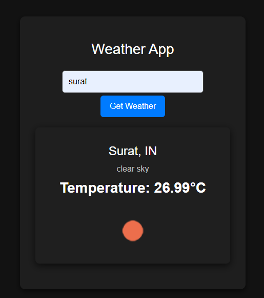

# Weather App 🌤️

Welcome to the **Weather App**, where you can effortlessly check the weather in any city around the world! 🌍

This app connects you with real-time weather data from OpenWeather's API, providing a sleek and intuitive experience as you search for the current weather conditions in your chosen location. The magic of fetching and displaying weather data is done in the blink of an eye—thanks to JavaScript and the power of APIs! ✨

  <!-- Add this line to include your screenshot -->

## Features 🚀

- **Real-Time Weather Updates** ⏱️: Instantly check the weather for any city with a click of a button.
- **City Search** 🌆: Enter a city name and get detailed weather information, including temperature, weather description, and icon.
- **Responsive Design** 📱💻: Designed to look great on both mobile and desktop devices.
- **Weather Icons** 🌈: Visualize weather conditions with accurate icons sourced from OpenWeather.

## How It Works 🛠️

1. **Search for a City**: Enter the name of a city in the search bar, and click the search button 🔍.
2. **API Magic** ✨: The app sends a request to the OpenWeather API using the city name, asking for real-time weather data.
3. **Get Results** 📊: The data is fetched and displayed on your screen. The app shows the city name, country, weather description, temperature (in Celsius), and an icon that represents the weather condition.
4. **Error Handling** ⚠️: If the city is not found or there’s a problem, you’ll be notified with a clear error message.

## Technologies Used ⚙️

- **JavaScript** 🖥️: For handling user interactions, API calls, and dynamic content display.
- **HTML/CSS** 🌐: To structure and style the user interface, making it sleek and user-friendly.
- **OpenWeather API** 🌤️: The backbone of the app, providing real-time weather data for cities worldwide.
- **Async/Await** ⏳: Making API requests smoother and more readable.

## Installation 🏗️

1. Clone the repository to your local machine:
    ```bash
    git clone https://github.com/your-username/weather-app.git
    ```

2. Navigate into the project directory:
    ```bash
    cd weather-app
    ```

3. Open `index.html` in your web browser, and voilà! You're ready to explore the weather 🌦️.

## How to Run 🌍

Once the project is cloned, open `index.html` in your browser. Enter the name of any city in the search box, hit the search button, and watch as the weather data appears right before your eyes! 😎

## New Learnings 📚

Building this Weather App taught me the exciting world of **APIs**! I learned how to send requests to external services, how to handle responses asynchronously, and how to deal with errors gracefully. 🌟 Dealing with real-time data and ensuring everything is displayed correctly was both challenging and rewarding. Each city search felt like an adventure as I connected to new data sources across the globe. 🌏

---

Enjoy checking the weather, and may your skies always be clear! ☀️🌈
