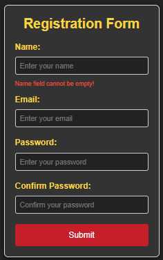
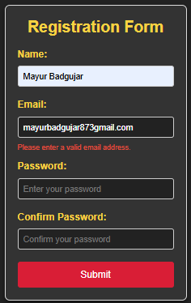
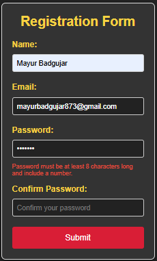
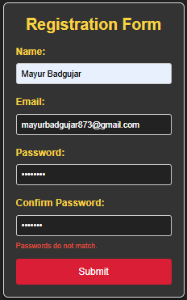
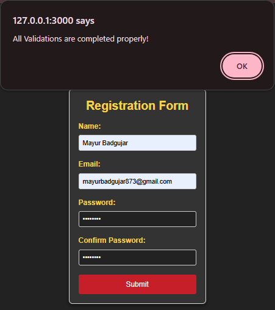

# 🚀 Form Validator - A Journey to Master Validation & Error Handling 🚀

Welcome to the **Form Validator** project! This project is more than just a form validation tool—it's your gateway to learning **error handling** and working with **external libraries** like never before. Whether you're a beginner diving into the world of validation or an experienced developer brushing up on your skills, this tool will give you the hands-on experience you need.

### 🎯 Objective
The goal of this project is simple: **to validate form inputs** and **handle errors gracefully** using JavaScript. It's not just about checking if the user input is correct—it's about making sure the user gets immediate feedback and understands what went wrong, all while learning the power of external libraries like **Validator.js**. 🧠✨

### 🔧 Features

- **Real-Time Validation**: As the user submits the form, their input is immediately validated.
- **Custom Error Handling**: Displays helpful error messages for incorrect input (e.g., invalid email, empty name, mismatched passwords).
- **External Library Usage**: We use the powerful **Validator.js** library to handle email validation. This teaches you how to integrate libraries with your projects for more robust functionality.
- **User-Friendly Feedback**: Each validation step gives the user clear, specific error messages and helps them fix mistakes quickly. 💡

### 📜 Technologies Used

- **HTML**: Structure and layout of the registration form.
- **CSS**: Basic styling to make the form visually appealing.
- **JavaScript**: The heart of the project, implementing validation logic and error handling.
- **Validator.js**: A powerful external library to handle email validation and ensure correctness.

### 🛠 How It Works

1. **Form Submission**: 
   When the user clicks the "Submit" button, the JavaScript function kicks in. It starts validating all fields:
   - **Name**: Cannot be empty.
   - **Email**: Must be a valid email address.
   - **Password**: Must be at least 8 characters long and contain a number.
   - **Confirm Password**: Must match the entered password.

2. **Error Handling**: 
   If any field fails validation, an error message appears under the corresponding input, guiding the user on how to fix it. We use `try-catch` blocks to catch errors and handle them appropriately.

3. **External Validation Library**: 
   We use the **Validator.js** library to check if the email is correctly formatted. If it's not, we throw an error and inform the user.

4. **Success**: 
   If all validations pass, the form is submitted, and the user is notified that everything is correct with a success message! 🎉

---

### 🖼️ Step-by-Step Screenshots

Here are some screenshots that show the progression of the form as it goes through different validation stages. Each step highlights the changes and how the form responds to incorrect input.

1. **Step 1: Initial Form**  
     
   The form starts with empty fields, ready for user input. 🌱

2. **Step 2: Name Validation**  
     
   After trying to submit with an empty name, an error appears, reminding the user that the name cannot be empty. 🚨

3. **Step 3: Email Validation**  
     
   When the user enters an invalid email, the form alerts them with a clear message to provide a valid email address. 📧

4. **Step 4: Password Validation**  
     
   If the password is too short or lacks a number, the form gives feedback on the necessary password requirements. 🔑

5. **Step 5: Successful Submission**  
     
   Finally, after all validations pass, the form submits successfully, and the user is notified of the successful form submission. 🎉

---

### 📝 Installation Instructions

1. **Clone the repository** to your local machine:
   ```bash
   git clone https://github.com/mayurbadgujar03/JavaScript-20-Day-Challenge-Building-20-Basic-Projects.git
   cd form-validator
   ```
2. **Install Dependencies**:
   This project uses a CDN to load the **Validator.js** library. Make sure you have an internet connection while running the project.

3. **Open the Project**:
   - Simply open the `index.html` file in your preferred web browser to start using the form validator.

4. **Test the Form**:
   - Enter incorrect details (like an empty name, invalid email, mismatched passwords) and watch how the error handling works. You'll see how the form responds to invalid input and guides you to correct it.

---

### 🚨 Error Handling in Action

Watch the magic unfold as we carefully handle every error that comes our way:

- **Name Field**: If the name is left empty, an error message will show up, reminding the user that the name cannot be empty.
- **Email Validation**: Using the Validator.js library, the email is checked for correctness. If the email format is invalid, the user is informed immediately.
- **Password Requirements**: The password needs to be at least 8 characters long and must contain a number. If the password doesn't meet these requirements, the user is informed.
- **Password Match**: If the passwords entered in "Password" and "Confirm Password" fields do not match, an error message guides the user to fix it.

---

### 🌟 Key Learning Outcomes

- **Error Handling**: You will understand how to gracefully handle errors using try-catch blocks and inform the user about what went wrong.
- **Form Validation**: You'll learn to validate multiple fields with complex rules, ensuring all user input is correct before submission.
- **External Library Usage**: By using Validator.js, you will gain the experience of incorporating third-party libraries into your projects, expanding your development toolkit.
- **User Experience**: You'll learn how to make forms more interactive, user-friendly, and responsive.

---

### 🛑 Note

This project requires an internet connection to load the Validator.js library via CDN. If you want to host the library locally, you can download it and reference it from your project folder.

---

### 🌍 Let's validate and conquer the world of form handling together! Happy coding! 💻🎉

