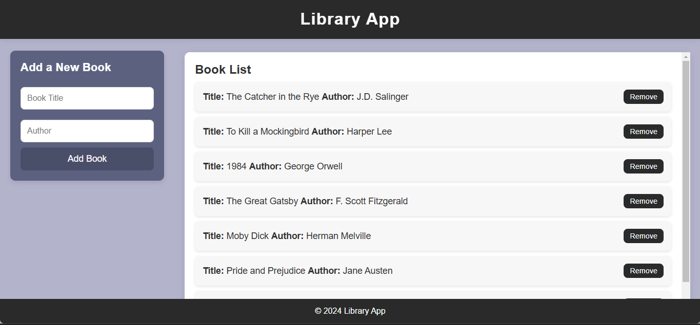
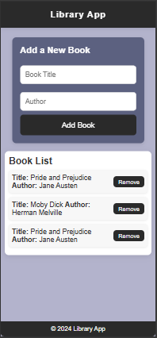

# 📚 **Library App**: A Digital Haven for Book Lovers 🏰

Welcome to the **Library App**, an interactive platform that allows you to manage and keep track of your cherished book collection. This app brings a fresh, modern twist to your everyday reading experience, helping you organize and remove books with ease. 📖✨

## 📖 **The Story Behind the App**

In a world full of distractions, we often find ourselves misplacing our favorite books, forgetting what we’ve read, or losing track of what’s next on our reading list. This app is the solution to that problem. With a clean, minimalist design and smooth functionality, the Library App allows you to manage your book collection right from the comfort of your browser. It’s as if you’re the librarian of your own personal library! 🏛️

Though the goal was to learn the concept of classes, this app was built without them. The journey turned out to be just as fun and educational, using simple DOM manipulation to create a powerful and user-friendly experience. 🚀

## ⚙️ **Features**

- **Add Books**: Input the title and author of any book, and it will appear on your library list! 📚
- **Remove Books**: You can remove books from your list with just a click, keeping your library tidy! ❌
- **Modern and Responsive**: The app works on both desktop and mobile devices, ensuring you can manage your collection anywhere, anytime! 📱💻
- **Elegant UI**: The smooth, minimal design provides a calm and efficient user experience. 🌟

## 💻 **Technologies Used**

- **HTML**: The backbone of our app, structuring the book list and forms. 🏗️
- **CSS**: Styling the layout and ensuring the app is visually appealing. 🎨
- **JavaScript**: Bringing the app to life by enabling dynamic book management and interactions. ⚡

## 🔧 **Installation Instructions**

To get started with the **Library App**, simply follow these steps:

1. **Clone the repository**:
    ```bash
    git clone https://github.com/mayurbadgujar03/JavaScript-20-Day-Challenge-Building-20-Basic-Projects.git
    ```

2. **Navigate into the project folder**:
    ```bash
    cd library-app
    ```

3. **Open the `index.html` file** in your browser to see the app in action! 🌐

---

## 🎯 **How It Works**

The app allows you to add books by filling out a form with the book's title and author. Once submitted, your new book will be displayed on the screen as a list item. Each item comes with a remove button to easily delete a book when you no longer need it. 🌟📚

#### **Add Book Form:**
- The user enters a title and an author, and upon hitting submit, the new book is added to the list. 📋

#### **Book List:**
- The book list displays all the books you’ve added, each with a button to remove it when desired. 🧹

---

## 📸 **Screenshots**

Take a look at how the **Library App** looks on different devices:

### Desktop View:


### Mobile View:


---

## 💬 **Feedback & Questions**

If you have any questions, suggestions, or feedback, don’t hesitate to reach out! You can open an issue or create a pull request directly in the repository. Let’s keep the reading community growing! 🌱

---

## 🌟 **Happy Reading!**

Thanks for using the **Library App**! May your book collection grow endlessly, and may your love for reading never stop! 📚❤️
