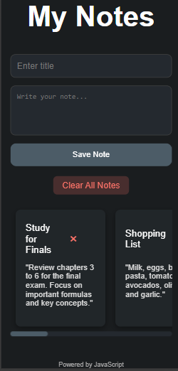
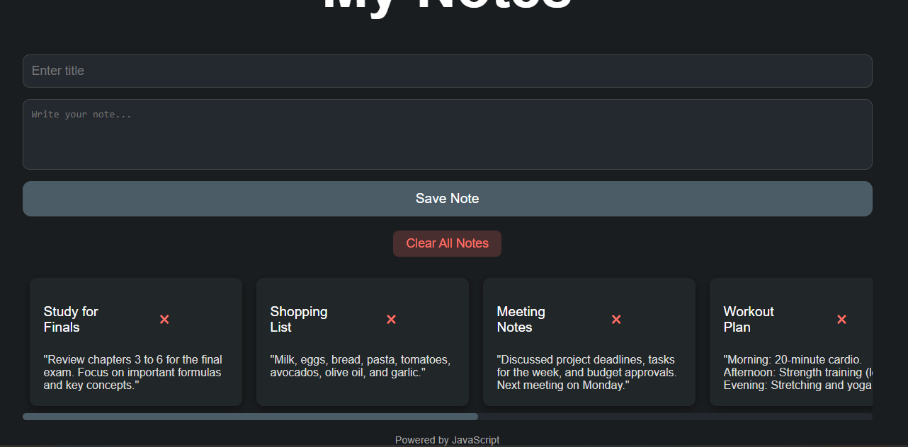

# 📒 **Notes App** 📝

Welcome to the **Notes App**—a sleek, minimalist, and powerful tool to capture your thoughts, ideas, and to-dos with ease! Whether you're a student, a busy professional, or a creative mind, this app is designed to help you keep your notes organized, accessible, and always within reach. 📱✨

---

## 🌟 **Story Behind The App** 📖

Ever had that sudden burst of inspiration while you're on the go, only to lose it because you couldn't jot it down fast enough? Or maybe you've been stuck with disorganized sticky notes scattered everywhere, struggling to find that one important idea? 

**The Notes App** was born to solve these problems. With a clean and intuitive interface, it allows you to quickly add, view, and delete notes, ensuring that your thoughts are captured and easily retrievable—anytime, anywhere! 🧠✨

---

## 🚀 **Features** 🎉

- **Add Notes**: Easily create notes with a title and content. Every idea, no matter how big or small, gets a place to live. 💡
- **Delete Notes**: Quickly delete notes that no longer serve you with a single click. 🗑️
- **Clear All Notes**: Ready to start fresh? The "Clear All" button removes all your notes in an instant! 🔥
- **Sticky Storage**: Your notes are stored locally in your browser, ensuring they're always there when you need them. 🔒
- **Sleek and Responsive Design**: The app adapts to any screen size, making it perfect for both desktop and mobile use. 📱💻
- **Dark Mode Vibes**: The app's dark, ambient theme is easy on the eyes—perfect for late-night note-taking sessions. 🌙

---

## 🔧 **Technologies Used** ⚙️

- **HTML5**: For the basic structure of the app. 📄
- **CSS3**: For beautiful styling that brings this app to life. 🎨
- **JavaScript**: For the dynamic functionality, including adding, deleting, and clearing notes. 🚀
- **LocalStorage**: To store your notes locally in the browser, keeping them safe and ready for your next inspiration! 🛡️

---

## 🏃‍♂️ **How It Works** 🔄

1. **Create**: Add a title and content to your note and hit submit! 🖊️
2. **View**: Your note will appear instantly in the list. 📑
3. **Delete**: If a note no longer serves you, just hit the “×” button to remove it. 💥
4. **Clear All**: Feeling overwhelmed? Hit "Clear All" to start fresh! ✨

All your notes are stored locally in **localStorage**, so even if you refresh the page, they’ll be waiting for you! 🔄

---

## 🛠️ **Installation Instructions** 👨‍💻

To get started with the **Notes App**, follow these steps:

1. **Clone the repository**:  
   Open your terminal and run:
   ```bash
   git clone https://github.com/mayurbadgujar03/JavaScript-20-Day-Challenge-Building-20-Basic-Projects.git
   ```
2. **Navigate to the project folder:**
  ```bash
    cd notes-app
  ```
3. **Open the ```index.html``` file in your browser:** Simply double-click the file, and voilà! You can start adding, deleting, and organizing your notes. 🖥️✨

## 📸 **Preview** 👀
Here’s a sneak peek of what you’ll see when you open the app:



## **💖 Why This App? 🧐**
We all need a space to capture fleeting thoughts, task lists, or creative ideas. Notes App was designed to be simple yet powerful—something that’s always ready, always there, and always intuitive. You can use it for anything—whether you’re writing down a shopping list, outlining a blog post, or creating a to-do list to conquer your day. 📅

## **📝 Let’s Get Writing! ✨**
So what are you waiting for? Dive into the Notes App today and never lose a great idea again! 💭

---

Made with ❤️ and a lot of JavaScript!
