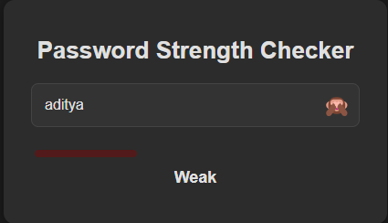
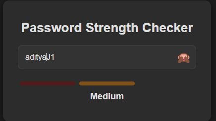
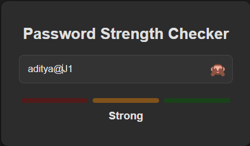

# 🚨 **Password Strength Checker** 🛡️

## 💡 **The Story Behind the Project** 📖

In the world of the digital age, where security is of the utmost importance, we find ourselves constantly battling against malicious hackers, data breaches, and compromised accounts. It's no longer enough to just have a password, but a *strong* password, one that resists even the most sophisticated attacks. 

Enter the **Password Strength Checker**, a simple yet powerful tool designed to help you create passwords that will keep your accounts safe from prying eyes. This project was created with the intention of educating users on what makes a password strong and giving them real-time feedback as they create it. No more guessing whether your password is secure enough — **this checker will tell you exactly where you stand**!

## 🔥 **Features** 🔥

- **Real-time Feedback**: As you type, get instant feedback on your password strength. You'll know whether you're creating a weak, medium, or strong password as you go! ⚡
- **Visibility Toggle**: Show or hide your password with just a click of an eye 👁️. 
- **Custom Strength Meter**: A color-coded password strength meter that fills up as your password gets stronger 💪.
- **Security Awareness**: Learn about the key components that make up a secure password — lowercase & uppercase letters, numbers, and special characters.

## 🛠️ **Technologies Used** ⚙️

- **HTML**: The backbone structure of the app.
- **CSS**: Styling the app to make it visually appealing.
- **JavaScript**: The magic that powers the password strength checker and the eye-toggle functionality. ✨

## 🚀 **How It Works** 🛸

When you enter your password into the input box, **Password Strength Checker** will evaluate it based on a few simple rules:
1. **Weak**: If your password is shorter than 6 characters, it's flagged as weak. 🛑
2. **Medium**: If it includes at least one lowercase letter, one uppercase letter, one number, and is 6 characters or longer, it's marked as medium strength. ⚖️
3. **Strong**: A password that's at least 8 characters long and includes lowercase, uppercase, numbers, and special characters like `@$!%*?&` is considered strong. 🔐

As you type, the strength meter shows you exactly how your password is doing. If you're feeling unsure about the security of your password, our checker is here to reassure you! 💼

## 📸 **Screenshots** 📸

### 1. **Full Screen View**  
This is where all the magic happens! Enter your password and see the feedback in real-time. 🔍


### 2. **Weak Password**  
If your password doesn't meet the minimum requirements, you'll see a warning! ⚠️



### 3. **Medium Password**  
Once you've added numbers and uppercase letters, your password will reach "Medium" strength! 🟡



### 4. **Strong Password**  
When your password includes everything it needs to be secure, you'll get the ultimate "Strong" status! 🟢



## 🏁 **Installation** 🏁

1. **Clone the repository**  
   ```bash
   git clone https://github.com/mayurbadgujar03/JavaScript-20-Day-Challenge-Building-20-Basic-Projects.git
    ```
2. **Open the ```index.html``` file in your browser**
That's it! You're ready to start checking your passwords.
---
## **🎉 Let’s Secure Your Passwords! 🎉**
So what are you waiting for? Create a secure password, and let Password Strength Checker help you keep your accounts safe from any potential threat! 🚀
