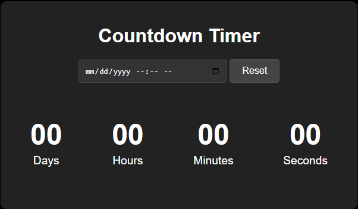
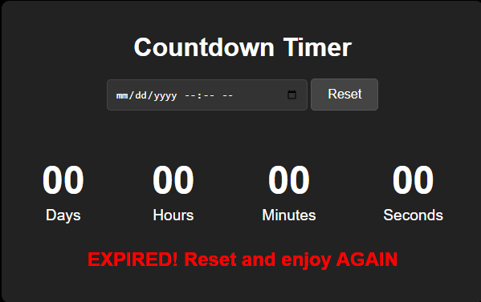
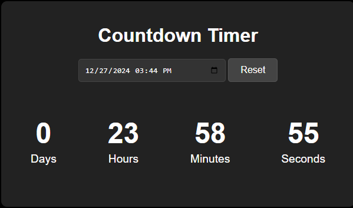

# ⏳ **Countdown Timer** ⏳

## 🕰️ **The Countdown Begins!** 🎉

Time is an unyielding force. Every moment is precious, especially when you're counting down to something important. Whether it's a milestone event, a deadline, or just the excitement of an upcoming occasion, the **Countdown Timer** is here to help you make the most of every second.

Imagine you’re preparing for your best friend’s birthday or eagerly awaiting the release of a new game. The countdown is ticking down, and every second that passes is one step closer to the big moment. This simple yet powerful tool keeps track of time for you, updating in real-time and ensuring you never miss that special moment.

Once the timer hits zero, the adventure is over, but no worries! You can easily reset it and set a new countdown. Ready to take on the next challenge? Let's go! 🔄

## 🔥 **Features** 🔥

- **Real-Time Countdown**: Watch the time tick away in days, hours, minutes, and seconds as your event approaches. ⏰
- **Custom Date Input**: Select your desired date and time for the countdown — whether it's for a special event or deadline. 📅
- **Reset Button**: When the countdown ends, reset the timer and start a fresh countdown whenever you like! 🔄
- **Expiry Alert**: The timer will notify you once the event has expired, with a fun message letting you know it’s time to reset and enjoy again. 🎉

## 🛠️ **Technologies Used** ⚙️

- **HTML**: Structure of the timer interface and form.
- **CSS**: Styling for the timer and buttons, ensuring it's visually appealing.
- **JavaScript**: The core logic that powers the countdown functionality and resets the timer.

## 🚀 **How It Works** 🛸

1. **Input the Date**: Choose a specific date and time for your event by clicking on the input field. The timer will start once a valid date is selected. 📅
2. **Live Countdown**: As the timer counts down to your set date, the days, hours, minutes, and seconds will update in real-time, giving you a live view of how much time is left. ⏳
3. **Expired Notification**: Once the timer hits zero, it will show a message saying **"EXPIRED!"** and reset the timer to zero. You can then start the countdown over again! 🔁
4. **Reset Button**: If you want to stop the countdown or reset it at any time, simply press the reset button, and everything goes back to the starting point. 🔄

## 📸 **Screenshots** 📸

### 1. **After Reset**  
The timer is reset and ready to start counting down again. All fields are cleared, waiting for the next date input. 🔄



### 2. **Expired Timer**  
When the countdown hits zero, the timer expires, and the message **"EXPIRED!"** is displayed. It's time to reset and start the countdown once more! ⏳



### 3. **On Countdown**  
The timer is actively counting down, showing the remaining time in days, hours, minutes, and seconds. ⏰



## 🏁 **Installation** 🏁

1. **Clone the repository**  
   ```bash
   git clone https://github.com/mayurbadgujar03/JavaScript-20-Day-Challenge-Building-20-Basic-Projects.git
    ```
2. **Open the ```index.html``` file in your browser**
That's it! You're ready to set your countdown and track time to your important event.

---

## **🎉 Let’s Count Down to Something Special! 🎉**
With the 16 Countdown Timer, you can make every second count! Whether you're eagerly awaiting a birthday, planning an event, or simply need to stay on track, this timer will help you manage time like never before. ⏳
