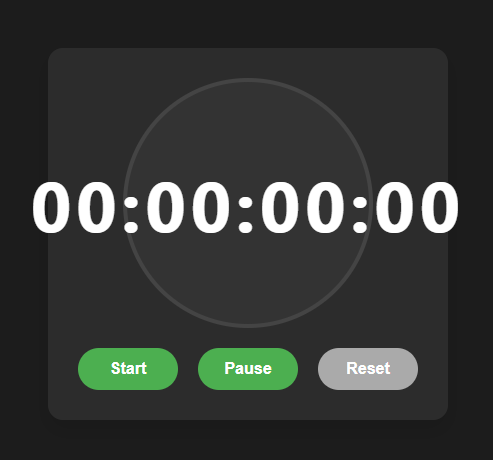

# ⏱️ **Stop Watch**: The Ultimate Timer for Every Moment ⏱️

---

## 🌟 **The Story Behind the Stopwatch** 🌟

In the fast-paced world we live in, every second counts! ⏳ Whether you're working on a big project, timing your workout 🏋️‍♂️, or simply measuring time as it slips through your fingers, **Stop Watch** is here to make every moment count.

This simple yet powerful tool lets you track hours, minutes, seconds, and even fractions of a second with ease. It’s more than just a timer—it’s your companion in measuring time’s precious flow. ⏲️

---

## 🚀 **Project Features** 🚀

✨ **Precise Time Tracking**  
With a seamless interface, this stopwatch tracks hours, minutes, seconds, and tenths of a second. ⏱️

🎮 **Start, Pause, and Reset**  
Easily control the stopwatch with buttons for starting, pausing, and resetting the timer. Each action is intuitive and designed to keep you in control of your time. 🛠️

🧭 **Continuous Measurement**  
Never worry about missing a second again! The stopwatch automatically updates in real time, allowing you to focus on what matters. 🔄

🎨 **Visually Stunning**  
The countdown is shown in a dynamic, easy-to-read format. Watch the numbers change in real-time as you control the flow of time. 🔢

---

## 🎬 **How It Works** 🎬

1. **Start the Timer** ⏯️  
   Click the "Start" button to begin the stopwatch and track your precious moments.

2. **Pause the Timer** ⏸️  
   Need a break? Click "Pause" to stop the timer right where you are.

3. **Reset It All** 🔄  
   Need to start over? Click the "Reset" button, and watch the timer set back to zero, ready for a new round.

---

## ⚙️ **Technologies Used** ⚙️

- **HTML** 📝: For structuring the interface.
- **CSS** 🎨: To style the elements and make it look sleek and functional.
- **JavaScript** 💻: To power the stopwatch, making it interactive and responsive to user actions.

---

## 🛠️ **Installation Instructions** 🛠️

1. **Clone this Repository**:  
   ```bash
   git clone https://github.com/mayurbadgujar03/JavaScript-20-Day-Challenge-Building-20-Basic-Projects.git
    ```
2. **Open the HTML File:**
Navigate to the ```index.html``` file in your browser to see the stopwatch in action.

## 🖼️ **Screenshots** 🖼️



## 🎯 Use Case 🎯
Whether you’re timing your sprints 🏃‍♀️, tracking your productivity at work ⌨️, or just counting down the moments till your break 🍪, the Stop Watch is designed for everyone—from athletes to professionals to dreamers!

## 💬 Let's Connect 💬
If you have any feedback, questions, or just want to chat about how time flies, feel free to reach out!

---

Every moment matters. Don’t let time slip away. ⏳
