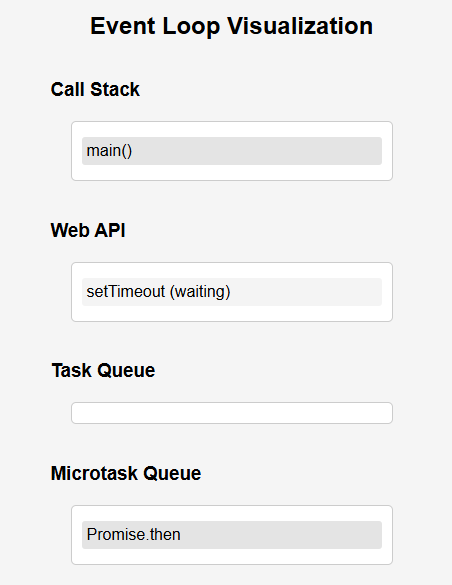

# 🌀 Interactive Tools for Event Loop Visualization 🌐

Welcome to **Interactive Tools for Event Loop Visualization**, an engaging and animated project where you can witness how JavaScript’s call stack, task queues, and microtask queues work in real-time! 🚀

## 📖 About

In the mysterious world of **JavaScript**, the event loop keeps everything running smoothly, but have you ever wondered how tasks are executed in the blink of an eye? 🤔 This tool visually explains the process by simulating a working environment for:

- **Call Stack** 🧑‍💻
- **Web API** 🌍
- **Task Queue** 📝
- **Microtask Queue** 📜

Get ready to explore JavaScript’s async behavior with **interactive animations** and see how tasks move through different queues. Whether you're a beginner or an advanced developer, this project will provide you with a fun, visual understanding of how the event loop works in practice. ⚙️✨

---

## 🧑‍💻 Features

- **✨ Real-time Visualization**: Watch the magic happen as tasks move between the call stack, web API, task queue, and microtask queue.
- **🔄 Interactive Animation**: Add simulated tasks and see them executed as per the JavaScript event loop's rules.
- **⏳ Control Buttons**: Simulate different events such as `setTimeout`, Promises, and DOM events to understand the event loop behavior.
- **💡 Educational Tool**: Aimed at helping developers (and learners) visualize the inner workings of JavaScript's async behavior.

---

## 🚀 Technologies Used

This project is built with the following tools and technologies:

- **HTML5** 🧑‍💻: The structure of the web page and the SVG visualization.
- **CSS3** 🎨: Styling and animation to make the event loop come to life.
- **JavaScript** 🤖: The brains behind the animations and event loop simulation, using the power of DOM manipulation and `setTimeout`/`Promises`.
- **SVG** 🖼️: For drawing the Call Stack, Task Queues, and Microtask Queues dynamically.

---

## 🎮 How It Works

Imagine you’re on a **journey** through the wild world of JavaScript's event loop. As you interact with the buttons, you’ll trigger different tasks:

1. **Main Function** 🏁: The event loop starts its journey with the main function (`main()`) being added to the call stack.
2. **Simulate Web API Tasks** 🌍: Web API functions like `setTimeout` and `API calls` add tasks to the **Task Queue** after their execution time.
3. **Promise Microtasks** 💭: Promises are added to the **Microtask Queue**, getting executed just before the next task from the task queue!
4. **Task Execution** 🛠️: Tasks from both queues eventually get picked up and processed in the call stack, just like a well-oiled machine. 🛠️

---

## 🏗️ Setup & Installation

To get started with this project, follow these steps to **set it up locally** on your machine:

1. **Clone this repository** to your local machine:
   ```bash
   git clone https://github.com/mayurbadgujar03/JavaScript-20-Day-Challenge-Building-20-Basic-Projects.git
    ```
2. **Navigate into the project directory:**
  ```cd interactive-event-loop-visualization```
3. **Open the index.html file** in your browser to view the project:

```open index.html  # or simply double-click the file in your file explorer```
4. **Start experimenting** with the interactive buttons to simulate JavaScript tasks! 🎮

# 🛠️ How to Use

Once you’ve loaded the visualization in your browser, you can start exploring! Here’s how:

### Add main() to the Call Stack:
- The call stack begins its journey with the execution of `main()`. Watch it appear and disappear from the stack! 🧑‍💻

### Simulate a Web API Task:
- Click **Simulate Task** to add a `setTimeout`-based task to the Web API. It will then move to the Task Queue after the delay! 🕰️

### Add Microtasks:
- Click **Simulate Microtask** to add a promise-based task to the Microtask Queue. Watch it be processed right after the current call stack clears! 💭

---

## 📸 Screenshots

Here's a sneak peek at what the visual experience looks like:



---

## 🌟 Enjoy your adventure through the world of the Event Loop! 🌐
