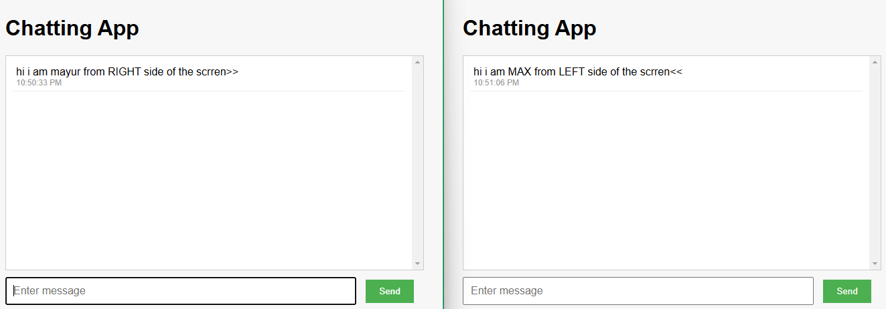

# 🗣️ **Chat Application: A Learning Journey** 💬

## 🧭 **The Beginning of the Adventure**

This Chat Application was created with the goal of learning **real-time communication** using **Socket.io**, **Express**, and **Node.js**. As a beginner, it took me two days to build and troubleshoot, but the experience was invaluable. 

---

## 💡 **App Features**

- 💬 **Real-time messaging**: Instant communication between users.
- 🧑‍🤝‍🧑 **Multiple users**: Connect and chat with anyone, anytime.
- ⚡ **Live updates**: Messages are broadcasted instantly to all clients.

---

## 🛠️ **Technologies Used**

- **Node.js** 🟩: Server-side JavaScript.
- **Express** 🌐: For serving files and routing.
- **Socket.io** ⚡: Real-time bidirectional communication.
- **HTML & CSS** 💻🎨: Simple front-end design.

---

## 🏃 **How It Works**

1. **Server Setup**: The app uses an **Express server** that serves the static files.
2. **Real-time Messaging**: **Socket.io** connects users and broadcasts messages instantly.
3. **User Connections**: When a user sends a message, it’s displayed on all connected clients.

---

## 🚀 **Setup and Run**

1. **Clone the Repo**:
   ```bash
   git clone https://github.com/mayurbadgujar03/JavaScript-20-Day-Challenge-Building-20-Basic-Projects.git
    ```
2. **Install Dependencies:**
  ```
  cd chat-application
  npm install
  ```
3. **Start the Server:**
  ```npm start```
  Open your browser at ```http://localhost:9000``` to start chatting! 🖥️💬

---
## **🖼️ Screenshot**
Here's a screenshot of the app in action:

---

## **🎉 The Learning Experience**
This project was a journey of trial and error, but it’s a great learning experience for anyone looking to understand how real-time messaging works. The obstacles were part of the fun, and I’m happy to share the outcome.

